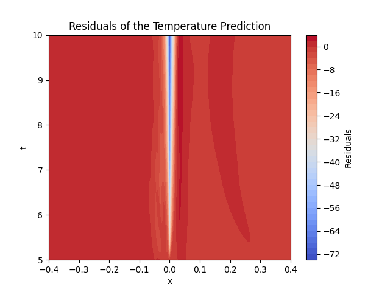

# Heat-Transfer-in-Advanced-Manufacturing-using-PINN
This is a PINN based approach in solving high temperature heat transfer equations in manufacturing industries, with a focus on reducing the energy consumption and optimizing the sensor positioning.

## Overview

Physics-Informed Neural Networks (PINNs) are a novel class of neural networks that leverage physical laws described by partial differential equations (PDEs) to inform the learning process. This project implements a PINN to model the temperature distribution in a solidification process.

## Process Description

This project is based on the research paper [Machine learning for metal additive manufacturing: Predicting temperature and melt pool fluid dynamics using physics-informed neural networks](https://arxiv.org/abs/2008.13547) by Qiming Zhu, Zeliang Liu, Jinhui Yan.

The paper introduces the concept of Physics-Informed Neural Networks (PINNs), which embed physical laws into the learning process of neural networks. The methodology uses automatic differentiation to incorporate the PDEs into the loss function, guiding the training process with both data and physical laws.

### Adaptation to TensorFlow 2.11.0

The original implementation provided in the paper was designed for TensorFlow 1.x, which is not compatible with TensorFlow 2.x. This repository contains a refactored version of the code, making it compatible with TensorFlow 2.11.0. The key changes include:

1. **Session Management**: TensorFlow 2.x uses eager execution by default, removing the need for explicit session management. However, to maintain the structure of the original code, the `tf.compat.v1.Session` is used for session-based execution.
2. **Optimizers**: TensorFlow 2.x has a new API for optimizers. The code now uses `tf.keras.optimizers` and the `minimize` method to handle optimization.
3. **Gradient Computation**: The `tf.GradientTape` context is used for computing gradients in TensorFlow 2.x, replacing the `tf.gradients` function from TensorFlow 1.x.
4. **Eager Execution Compatibility**: Ensured all tensor operations are compatible with eager execution to facilitate debugging and model development.

These changes ensure that the code is up-to-date with the latest version of TensorFlow, benefiting from improved performance, ease of use, and ongoing support.

## Model Explanation

### Process Details
The model predicts the temperature profile in the process of the solidification of Aluminium using a Graphite rod. This involves both heat conduction and phase change, modeled through a set of PDEs. The Aluminium starts in a liquid state and solidifies as it cools down. The model takes into account the latent heat of fusion and the difference in thermal properties between the solid and liquid phases of Aluminium.

The PINN model is trained to solve the following PDE:

$$
\frac{\partial T}{\partial t} = \alpha \nabla^2 T
$$

where T is the temperature, t is time, and α is the thermal diffusivity.

### Boundary Conditions

- **Dirichlet Boundary Condition**: Fixed temperature at the boundaries, which represents a constant temperature at the ends of the rod.
- **Neumann Boundary Condition**: Heat flux at the boundaries, which ensures the conservation of energy across the boundaries.

These boundary conditions are hard-coded into the loss function to ensure the solution adheres to the physical constraints of the problem.

### Heaviside Function
The Heaviside function is used to handle the phase change in Aluminium. It smooths the transition between the solid and liquid phases, ensuring numerical stability and convergence. The function is defined as:
$$
H(x) = \begin{cases}
0 & \text{if } x < 0 \\
1 & \text{if } x \geq 0
\end{cases}
$$

## Training

The model is trained for 50,000 epochs using the Adam optimizer with a learning rate of 0.001. The training process is as follows:

- **Pre-training**: Initial training with a reduced learning rate to stabilize the model.
- **Full training**: Further training with the full learning rate to minimize the loss function.

### Loss Function

The loss function is a combination of the data loss and the physics-informed loss:

$$
\text{Loss} = \text{MSE}(\hat{T}, T) + \lambda \cdot \text{PDE\_Loss}
$$

where:

- The first term is the mean squared error between the predicted and exact temperatures.
- The second term ensures that the predicted temperature profile satisfies the underlying PDE.
- Lambda is a weighting factor that balances the data loss and the PDE loss.

### Results

The PINN model achieved a mean squared error (MSE) loss of 0.19. Below are some visualizations of the predictions compared to the exact solutions.

- **Temperature Distribution**: A graph showing the exact and predicted temperature profiles.
- **Residuals**: The difference between the predicted and exact temperatures.
- **Scatter Plot**: A scatter plot comparing the exact and predicted temperatures.

### Visualisation

The model predicts temperature in Kelvin, time in seconds, and X in metres. Below are some visualizations of the results.


*Scatter plot of exact vs predicted temperatures.*



*Residual plot (Exact - Predicted temperatures).*


*Temperature distribution over time.*

These are the training loss curves for various different parametres:


*Training Loss Curve for constant LR = 0.001*


*Training Loss Curve for exponentially decayed LR*


*Training Loss Curve for cosine decayed LR*


*Training Loss Curve for polynomial(deg=2) decayed LR*

## References

This model and methodology are based on the research presented in the paper [Machine learning for metal additive manufacturing: Predicting temperature and melt pool fluid dynamics using physics-informed neural networks](https://arxiv.org/abs/2008.13547) by Qiming Zhu, Zeliang Liu, Jinhui Yan.

## Usage

Install the required dependencie using:
```sh
pip install -r requirements.txt
```
## License
This project is licensed under the MIT License - see the [LICENSE](LICENSE) file for details.